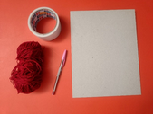
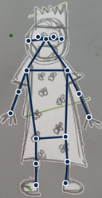

# Tallers-per-compartir

Recopilació d'eines educatives

Recopilat per [Jordi Mayné](https://github.com/maynej) des de Mechatronic Study jordi.mayne@mechatronicstudy.com 

L'objectiu es ccompartir aquest tipus d'eines.

Tota la [documentació es pot trobar en PDF](https://github.com/maynej/Tallers-per-compartir/DOC_CAT). 

## Propostes 
  
Descripció         | Imatge          | Arxiu         
------------- | ------------- | ------------- 
Bolígraf 2D Llana | | [Bolígraf 2D](DOC_CAT/TallerBoligraf2D_Llana_CAT.pdf)
Bolígraf 3D | | [Bolígraf 3D](DOC_CAT/Taller_de_Bolígraf_3D_CAT.pdf)
Dibuix animat | | [Dibuixos animats](DOC_CAT/TallerDibuixFotoAnimat_CAT.pdf)
Merge Cube | | [Merge Cube](DOC_CAT/Taller CubeMerge_CAT.pdf)
Quiver | | [Quiver](DOC_CAT/Taller Quiver_CAT.pdf)
Open LED Race | | [OLR](DOC_CAT/Taller OpenLEDRace_CAT.pdf)
Makey Makey | | [Makey Makey](DOC_CAT/Taller MakeyMakey_CAT.pdf)
Google 3D | | [Google 3D](DOC_CAT/Taller Google_CAT.pdf)
Tetris Balanci | | [Tetris Balancí](DOC_CAT/TallerTetrisBalanci_CAT)

Creative Commons Attribution-NoComercial-ShareAlike 4.0 International (CC BY-NC-SA 4.0)  

## QR

